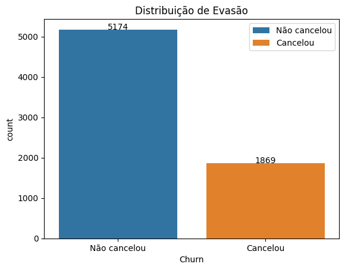
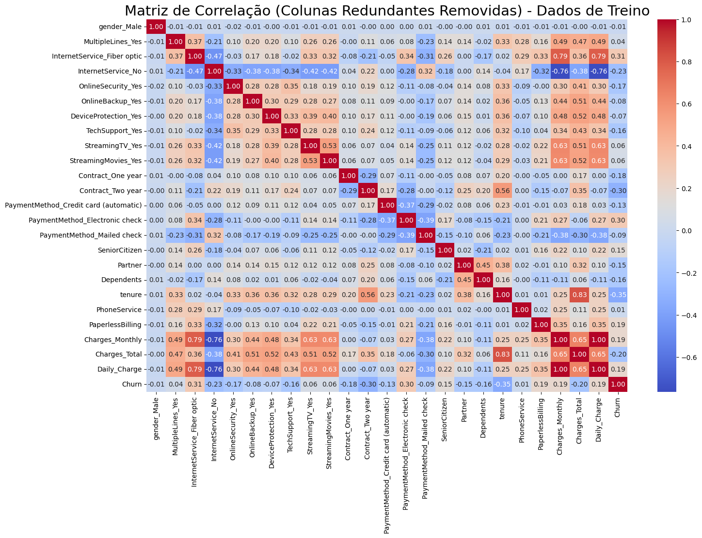
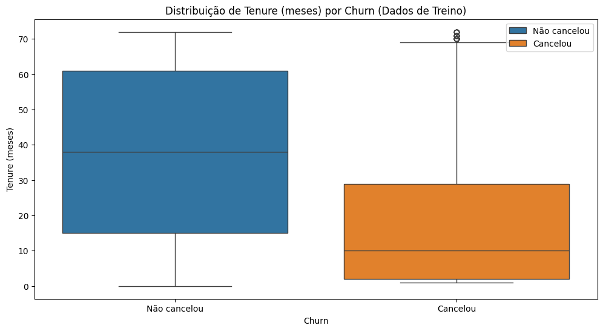
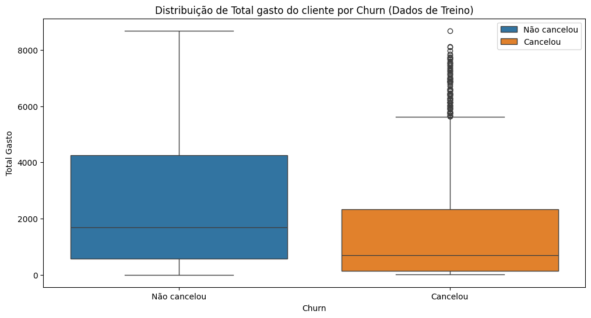
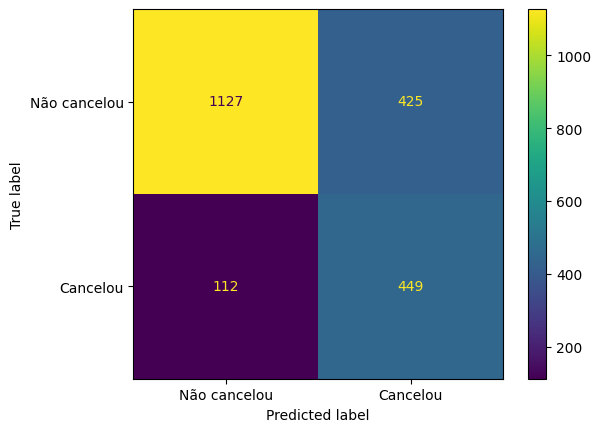
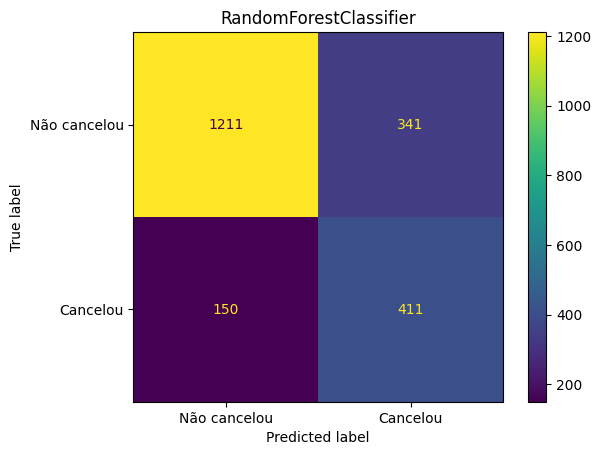
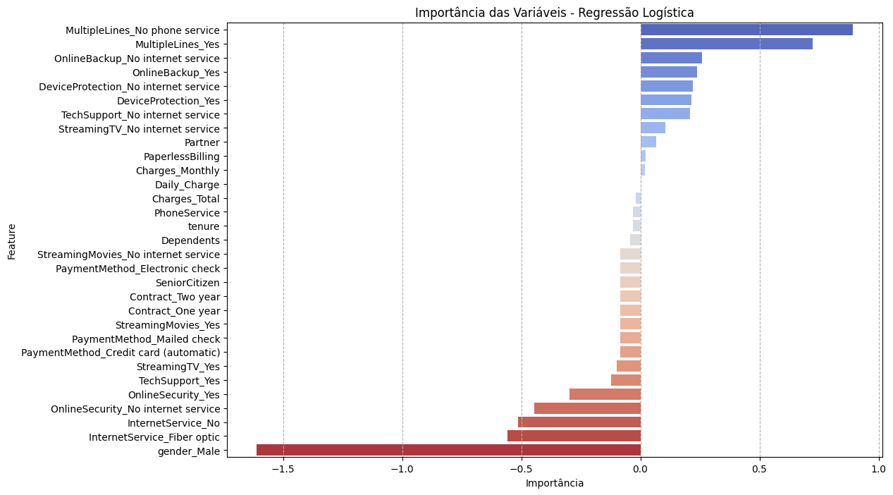
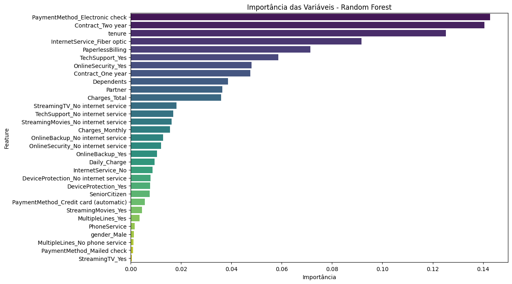
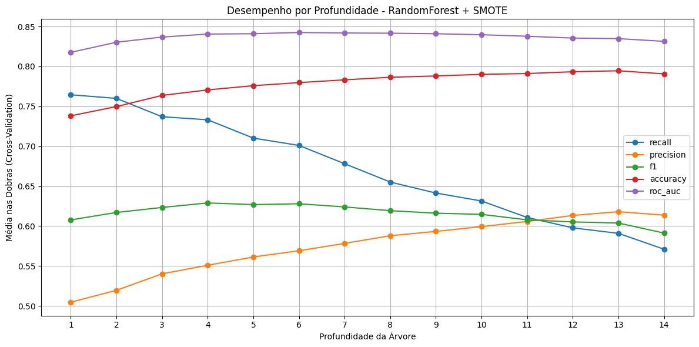

# 📊 Telecom X – Parte 2: Prevendo Churn de Clientes

## 🧠 Descrição do Desafio

Neste projeto, atuamos como Analista de Machine Learning Júnior na Telecom X. O objetivo é construir modelos preditivos para antecipar quais clientes têm maior chance de cancelar os serviços (churn), apoiando decisões estratégicas de retenção.

---

## 🎯 Objetivos

- Realizar pré-processamento dos dados (limpeza, encoding, normalização)
- Analisar a correlação entre variáveis
- Balancear as classes utilizando SMOTE
- Treinar e comparar dois modelos preditivos distintos (Regressão Logística e Random Forest)
- Avaliar desempenho e gerar insights estratégicos

---

## 🛠️ Etapas do Projeto

### 1. Preparação dos Dados

- **Remoção de colunas irrelevantes:** Exclusão do identificador único (`customerID`)
- **Encoding:** Aplicação de OneHotEncoder para variáveis categóricas
- **Normalização:** Uso de StandardScaler para modelos sensíveis à escala
- **Balanceamento:** Aplicação de SMOTE para equilibrar as classes (churn ≈ 26%)

---

### 2. Análise Exploratória e Visualizações

#### **Distribuição de Evasão**



*Este gráfico mostra a proporção de clientes que cancelaram e que permaneceram na base. Observa-se um desbalanceamento típico: cerca de 26% dos clientes realizaram churn. Esse cenário justifica o uso de técnicas de balanceamento como o SMOTE para evitar que o modelo seja tendencioso para a classe majoritária.*

---

#### **Matriz de Correlação**



*A matriz de correlação é uma das ferramentas mais valiosas para entender a relação entre as variáveis do nosso dataset e o churn. Ela permite identificar rapidamente quais atributos têm maior influência na evasão de clientes e também possíveis redundâncias entre variáveis.*

**Principais pontos observados:**

- **`tenure` (-0.35):** Forte correlação negativa com churn. Clientes com menos tempo de contrato são significativamente mais propensos a cancelar. Isso reforça a importância de estratégias de retenção nos primeiros meses.
- **`Contract_Month-to-month` (0.41):** É a variável com maior correlação positiva com churn. Clientes com contrato mensal têm muito mais chance de cancelar do que aqueles com contratos anuais ou bianuais.
- **`InternetService_Fiber optic` (0.31):** Usuários de fibra óptica apresentam risco elevado de churn, sugerindo que podem estar insatisfeitos com o serviço ou enfrentando maior concorrência.
- **`PaymentMethod_Electronic check` (0.30):** Clientes que pagam via cheque eletrônico também têm maior propensão ao cancelamento, indicando um possível perfil de cliente mais volátil ou insatisfeito com o método.
- **`Charges_Total` (-0.20):** Correlação negativa, mostrando que clientes com menor gasto total (geralmente por terem menos tempo de casa) tendem a cancelar mais.
- **`PaperlessBilling` (0.19) e `Charges_Monthly` (0.19):** Clientes com cobrança sem papel e mensalidades mais altas apresentam risco levemente maior de evasão.*

---

#### **Boxplots: Perfil dos Clientes que Cancelam**



*O boxplot acima compara o tempo de contrato (tenure) entre clientes que cancelaram e os que permaneceram. Fica claro que clientes que evadem tendem a ter contratos mais curtos, reforçando a importância do relacionamento de longo prazo para a retenção.*



*Já este boxplot mostra o total gasto pelo cliente. Clientes que permanecem costumam ter um gasto acumulado maior, o que está relacionado ao maior tempo de permanência. Isso sugere que clientes novos ou de baixo valor são mais propensos ao churn.*

---

### 3. Separação dos Dados

- Divisão em treino (70%) e teste (30%) com estratificação para manter a proporção de churn

---

### 4. Modelagem Preditiva

Foram treinados dois modelos principais:

| Modelo                | Normalização | Sensível à Escala | Tipo                |
|-----------------------|--------------|-------------------|---------------------|
| Regressão Logística   | ✅ Sim       | ✅ Sim            | Linear, baseline    |
| Random Forest         | ❌ Não       | ❌ Não            | Baseado em árvore   |

---

### 5. Avaliação dos Modelos

#### **Matrizes de Confusão**



*A matriz de confusão da Regressão Logística mostra que o modelo tem bom desempenho em identificar clientes que realmente cancelam (alto recall), mesmo que ocasionalmente classifique clientes fiéis como churn (falsos positivos).*



*Já a Random Forest apresenta maior precisão: quando prevê churn, geralmente está correta, mas pode deixar de identificar alguns clientes que realmente cancelam (menor recall).*

---

### 6. Importância das Variáveis

#### **Regressão Logística**



*O gráfico acima mostra o peso de cada variável na decisão do modelo linear. Variáveis como tempo de contrato, tipo de contrato e uso de fibra óptica têm grande influência na previsão de churn.*

#### **Random Forest**



*Na Random Forest, a importância das variáveis é medida pela redução de impureza nas árvores. Os fatores mais relevantes são semelhantes, mas o modelo também destaca o método de pagamento e serviços adicionais.*

---

### 7. Otimização do Random Forest



*Este gráfico mostra como diferentes profundidades das árvores afetam as métricas do modelo Random Forest. A escolha do parâmetro ideal busca equilibrar recall, precisão e F1-score, evitando tanto o underfitting quanto o overfitting.*

---

## 🏆 Conclusão

A análise e modelagem preditiva permitiram identificar padrões claros de evasão na base de clientes da Telecom X:

- **Regressão Logística** destacou-se pelo alto recall, sendo eficiente para identificar a maioria dos clientes que realmente irão cancelar. É o modelo mais indicado quando o objetivo é não deixar clientes em risco passarem despercebidos, mesmo que isso gere alguns falsos positivos.
- **Random Forest** apresentou maior precisão, tornando-se uma escolha interessante quando se deseja priorizar abordagens mais certeiras, reduzindo o número de clientes abordados erroneamente.
### 🔑 Principais fatores associados ao churn:

- ⏳ **Tempo de contrato baixo:** Clientes com pouco tempo de serviço são mais propensos a cancelar.
- 📅 **Contrato mensal:** Contratos do tipo "month-to-month" apresentam maior risco de evasão.
- 🌐 **Uso de fibra óptica:** Clientes que utilizam internet via fibra óptica têm maior probabilidade de churn.
- 💳 **Pagamento via cheque eletrônico:** Este método de pagamento está associado a maior risco de cancelamento.
- 💰 **Menor total gasto:** Clientes que gastaram menos ao longo do tempo tendem a cancelar mais.

Esses resultados reforçam a importância de estratégias de retenção focadas em clientes novos, com contratos flexíveis e métodos de pagamento mais voláteis, além de monitorar a experiência dos usuários de fibra óptica. O uso combinado dos modelos permite à empresa tanto ampliar o alcance das ações preventivas quanto otimizar recursos em campanhas mais direcionadas.

---

## ✅ Recomendações Estratégicas

- Foco em retenção de clientes com baixo tempo de contrato e contratos mensais
- Incentivo à migração para contratos de maior duração
- Investigação da experiência dos clientes de fibra óptica
- Ofertas e comunicação personalizada para clientes em risco

---

## 🔧 Tecnologias Utilizadas

- Python 3.10+
- Pandas, NumPy
- Scikit-learn, imbalanced-learn
- Matplotlib, Seaborn
- Jupyter Notebook / VSCode

---

## 🚀 Como Executar

1. Clone este repositório e acesse a pasta do projeto.
2. Instale as dependências:
   ```sh
   pip install -r requirements.txt
   ```
3. Execute o notebook `Challenge_TelecomX_(Parte_2).ipynb` em Jupyter, Colab ou VSCode.

Os dados são carregados automaticamente via URL no notebook.

---

## ✍️ Autor

Projeto desenvolvido por [Seu Nome] como parte do desafio de análise preditiva de churn no setor de telecomunicações.

---

## 📝 Licença

Projeto para
